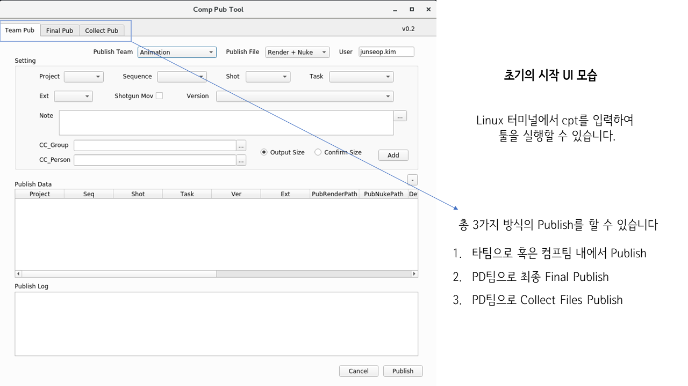
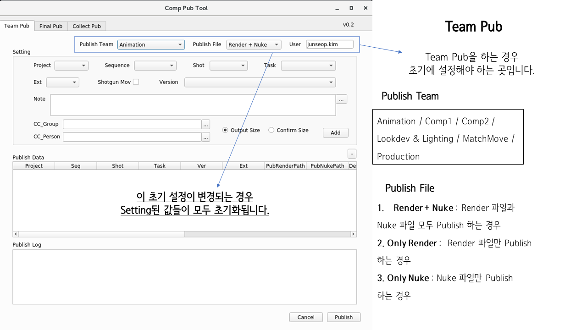
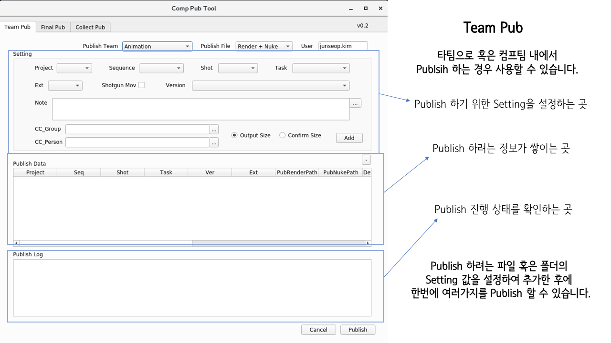
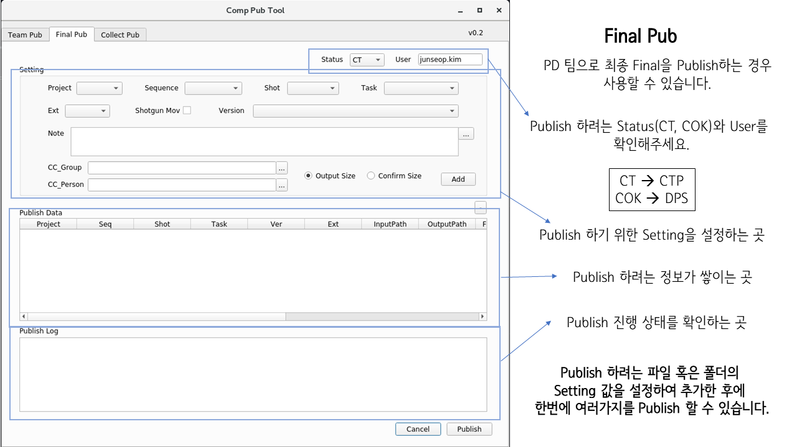
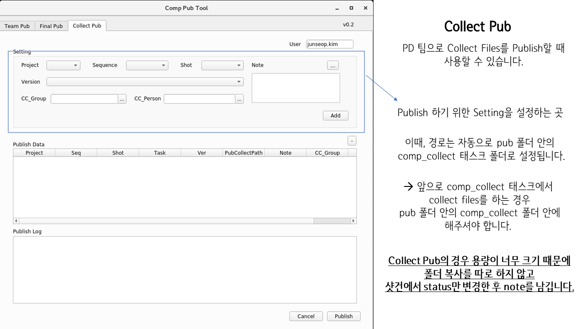
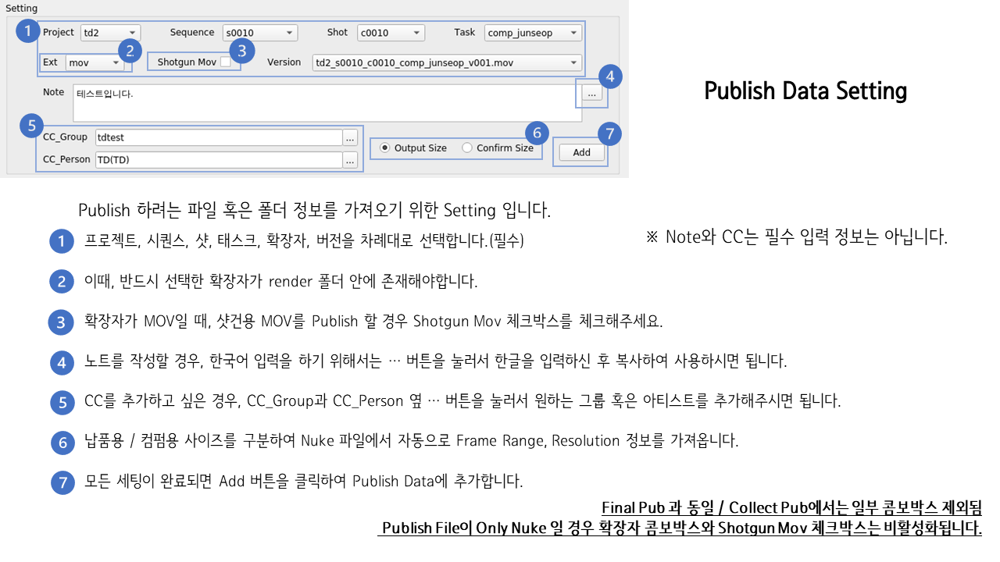
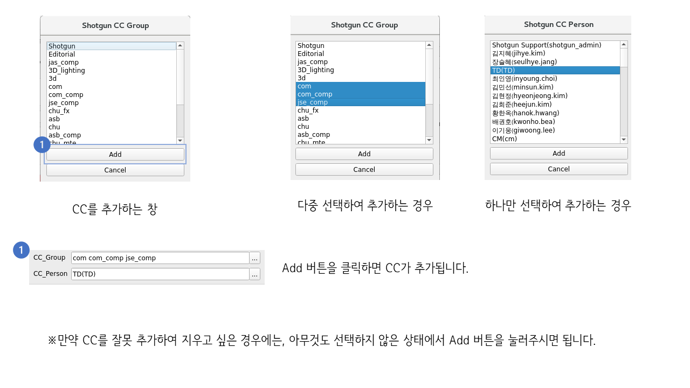
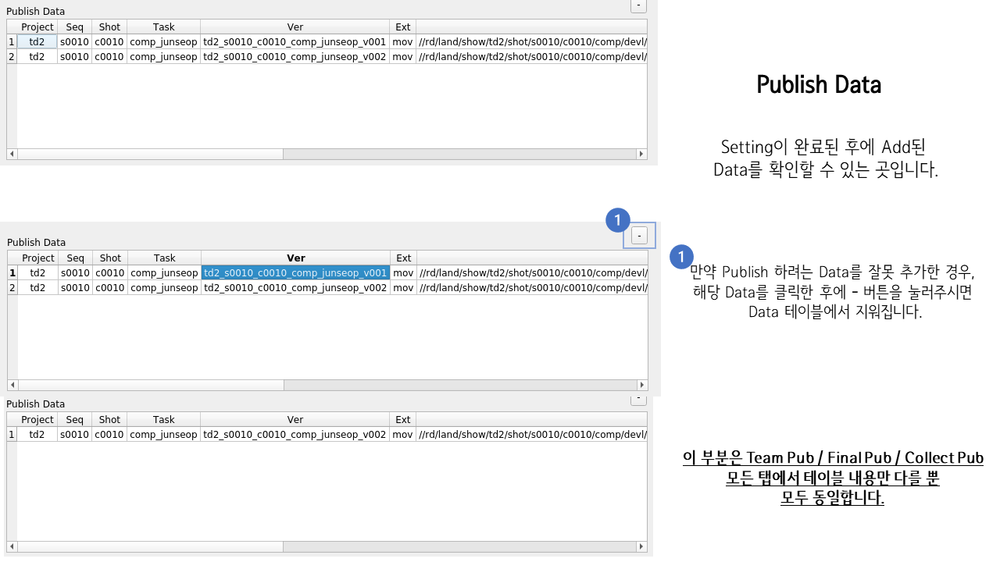
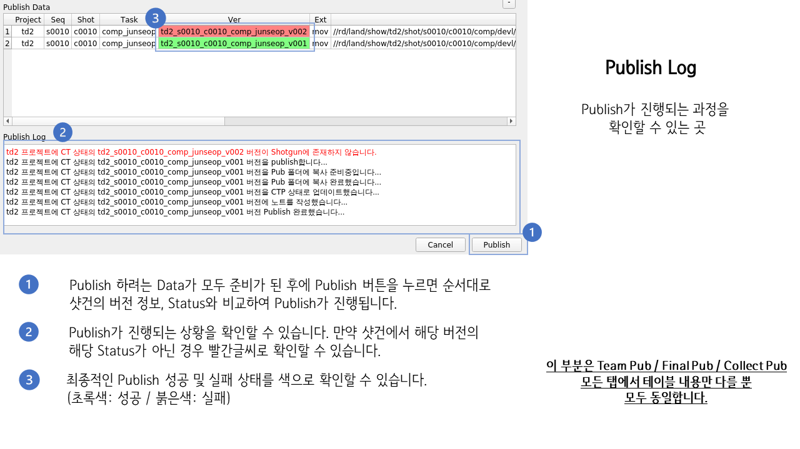
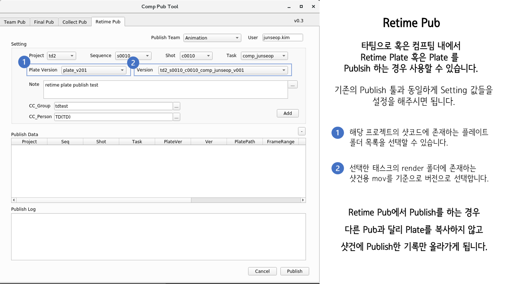

# Comp Pub Tool
Comp Publish Tool입니다.   
Comp팀에서 Publish하기 위해서 사용하는 툴입니다.   
 
-[개발백서](./docs/development.md)

 

### 개발 현황

v0.1: 현재는 Comp 팀에서 PD 팀으로 Publsih 하는 경우에 사용하실 수 있습니다.   
타팀으로 Publish 하는 기능은 추후에 개발될 예정입니다.

v0.2: 타팀 혹은 Comp 팀 내에서 렌더 파일 및 누크 파일을 Publish 하는 기능,   
Collect Files를 Publish 하는 기능이 추가되었습니다.

v0.3: Retime 플레이트를 Publish 하는 기능이 추가되었습니다.

 

### 사용 매뉴얼

